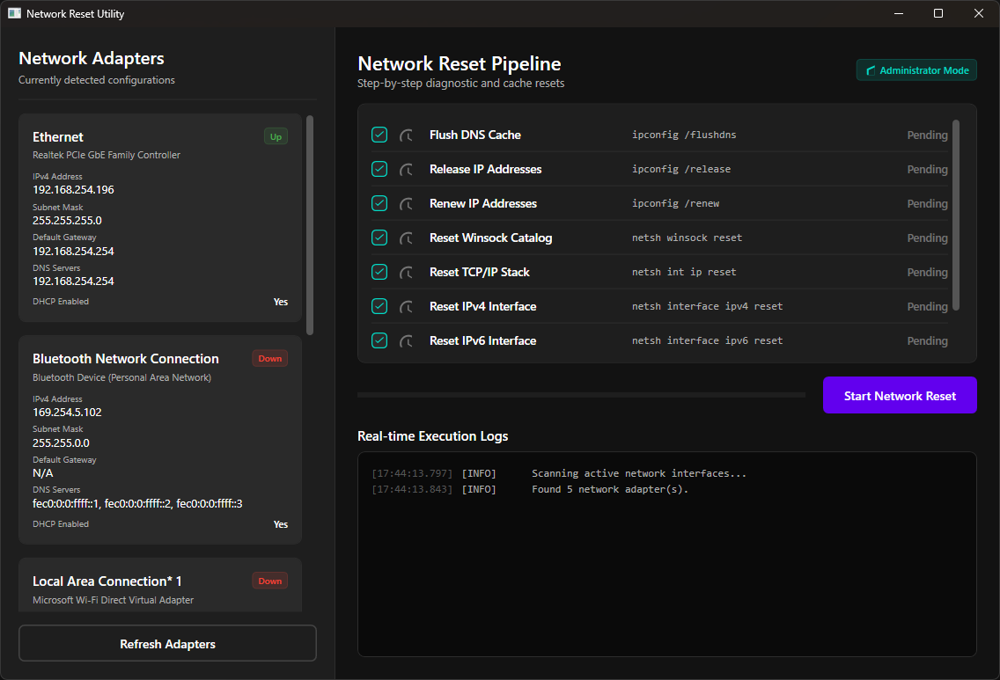

# Network Reset Utility



A modern, high-performance desktop tool built with C# and .NET 8.0 WPF. It executes network adapter diagnostic and reset commands in sequence, displaying real-time terminal logs and autodetecting network configurations. It runs with Administrator privileges via an embedded manifest.

---

## Technical Features

- **Vector-Drawn Status Indicators**: Uses crisp vector XAML Paths (checks, crosses, clock outlines, and spinners) for status indicators.
- **Material Dark Design**: Sleek dark backgrounds, modern layout, custom scrollbar styling, and smooth transition animations.
- **Asynchronous Processing**: Shell commands run in a background thread to prevent UI freezing.
- **UAC Privilege Elevation**: Manifest configures the application to require administrator rights on startup.

---

## How to Build the App (Single-File Release)

To compile the application into a **single framework-dependent executable**, run the following command in the project directory:

```bash
dotnet publish -c Release -r win-x64 --self-contained false -p:PublishSingleFile=true -o ./publish
```

### Options Breakdown:
- `-c Release`: Compiles in the optimized Release configuration.
- `-r win-x64`: Targets 64-bit Windows systems.
- `--self-contained false`: Creates a **framework-dependent** build. This requires the target machine to have the .NET 8.0 Desktop Runtime installed, reducing the file size drastically (to under ~200 KB).
- `-p:PublishSingleFile=true`: Packs all assemblies and resources into a single `.exe` executable.
- `-o ./publish`: Directs the final build artifacts to a folder named `publish` in the project root.

---

## How to Run

1. Navigate to the generated `publish` directory:
   `cd publish`
2. Run `NetworkResetTool.exe` as Administrator (Windows will automatically prompt with a User Account Control dialog upon launch).

---

## License

This project is licensed under the MIT License - see the [LICENSE](LICENSE) file for details.
